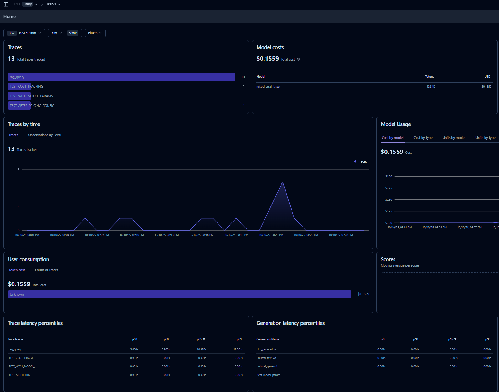
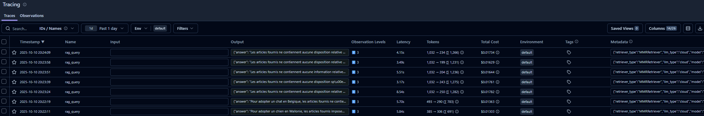

# LexBel 🇧🇪

> **Intelligent Legal Search for Belgian Law** — Conversational agentic RAG system that makes Belgian legal code accessible through natural language queries.


## What is LexBel?

LexBel allows citizens to ask though multimodal interface juridic questions answered by an agent anchored to a database of Belgian Code of Law in order to reduce hallucinations.

### Demo


https://github.com/user-attachments/assets/4271e1c9-f67f-417c-b058-fb79678b8e1e


## Covered Legal Codes

the corpus supporting the RAG system comprises 22,633 articles from 32 Belgian codes, collected in May 2021 by Antoine Louis and Gerasimos Spanakis.

> [!WARNING]
> Users might notice several limitations:

> - **Potentially outdated answers** due to the age of the dataset. (I may add internet search as a tool for the agent later on to circumvent it)
> - **Limited data**: Several important Code of Law are out of the scope, such as Labour, Social Law and Highway Code. Ordinary Laws, regulations are out of the scope as well.
Or as Louis, A., & Spanakis, G mention in their paper: *[...]the answer contained in the
remaining relevant articles might be incomplete, although it is still appropriate.*
> - **Small model**: A cost efficient model is used, which may not always return the most relevant results.


##  Quick Start

### Prerequisites

- Python 3.11+
- Docker
- Mistral, OPENAI, LangFuse API keys
- AWS account for deployment

### Installation


```bash
# Clone the repository
git clone https://github.com/P-mir/LexBel.git
cd LexBel

# Set up your environment
cp .env.example .env
# Edit .env and add your MISTRAL_API_KEY
# Optional -> LANGFUSE keys for monitoring

# Launch with Docker Compose
docker-compose up
```

Visit `http://localhost:8501`


### Tech Stack

**Core ML/AI**
- `sentence-transformers` — Multilingual embeddings (paraphrase-multilingual-mpnet-base-v2 for local run on cpu)
- `FAISS` — High performance Vector similarity search with
- **MMR (Maximal Marginal Relevance)** for diversity-aware retrieval
  - **Hybrid search** combining dense vectors + TF-IDF lexical matching
- `LangChain` & `LangGraph` for RAG orchestration & Agentic workflow
- `Mistral AI` for answer generation (mistral-small-latest)
- OPENAI `gpt-4o-transcribe` and `gpt-4o-mini`, respectivly for speech to text and LLM-as-a-judge
- `Langfuse` — observability and tracing


**Application Layer**
 `Streamlit`, `Pandas`, `Plotly`

**Infrastructure & devops**
- `AWS ECS` + `Fargate`
- `Docker`
- `uv` — Fast(er than poetry) dependency management
- `pytest`

**Code Quality & Security**
- Modularity & separations of concerns
- pre-commit hooks
- Type hints with mypy
- Logging (`logs/ingestion.log`)
- Bandit for vulnerability scanning


### Component level Evaluation: Retrieval results

Evaluation performed on 100 test queries from the legal QA dataset:

| Retriever | Config | MAP | MRR | P@5 | P@10 | P@20 | R@5 | R@10 | R@20 |
|-----------|--------|-----|-----|-----|------|------|-----|------|------|
| TF_IDF_Lexical | alpha=0.0 | 0.0665 | 0.1194 | 0.0606 | 0.0404 | 0.0323 | 0.1163 | 0.1283 | 0.2345 |
| Hybrid_alpha0.5 | alpha=0.5 | 0.1174 | 0.2013 | 0.0780 | 0.0730 | 0.0525 | 0.1621 | 0.3106 | 0.4200 |
| VectorOnly | alpha=1.0 | **0.2314** | **0.3356** | **0.1120** | **0.0800** | **0.0530** | **0.2672** | **0.3547** | **0.4401** |
| MMR_lambda0.7 (reranking) | lambda=0.7 | 0.1977 | 0.3046 | 0.0889 | 0.0556 | 0.0414 | 0.2268 | 0.2683 | 0.3529 |

The pure vector search retriever provide the best result, which may be explained by the fact that questions are asked by non specialist, while the corpus is filled or juridic jargon. Therefore semantic approach makes more sense than the lexical one.

### End-toEnd level Evaluation: LLM-as-a-judge

subjective eval is implemented using LLM-as-Judge. As unlabelled test set I use 100 of the questions collected by Droit Quotidien, as described by [Louis, A., & Spanakis, G](https://aclanthology.org/2022.acl-long.468.pdf).

Each answer noted on Relevance (in which measure does the answer answers the questions asked ?) and Groundedness (in which measure does the article relies on the corpus provided by the retriever ?).


The evaluation was run twice to assess if the system would benefit from a larger, more expensive model for Q&A generation. Below is a comparison of the two models:

| Model                                    | Avg. Relevance | Avg. Groundedness
|-------------------------------------------|:--------------:|:-----------------:|
| **Mistral Small 3.2 (hybrid_alpha1_topk10)**  |     4.57       |       4.37    |
| **Mistral Medium 3.1 (hybrid_alpha1_topk10)** |     4.74       |       4.62    |


Another improvement here might be to use a more powerful judge model in order to notice subtler mistakes in answers and thus be more discriminative in its judgement.

## Performance Metrics

On the "tableau de bord" tab, the following metrics are tracked:
- **Query processing time** (embedding + retrieval + generation)
- **Retrieval confidence scores** (cosine similarity)
- **Token usage** (input/output)
- **Source diversity** (across legal codes)

Analytics are saved to `data/metrics/` for continuous monitoring.


### Langfuse Monitoring & Tracing


**Dashboard**



track key metrics: query volumes, costs, tokens, latency metrics (P50/P95/P99).

**Trace Visualization to track individual query**



##  Development


### Adding New Legal Codes

1. Add CSV file to `data/` with columns: `id`, `article_number`, `article_text`, `code_name`
2. Run ingestion: `python scripts/ingest.py --input data/new_code.csv`
3. Vector store automatically updates
4. Deploy to aws through Github Action workflow

### Dataset Citation


> **Louis, A., & Spanakis, G.** (2022). *A Statutory Article Retrieval Dataset in French*.
> In Proceedings of the 60th Annual Meeting of the Association for Computational Linguistics (ACL 2022),
> Dublin, Ireland (pp. 6789–6803). Association for Computational Linguistics.
> https://doi.org/10.18653/v1/2022.acl-long.468

<details>
<summary>BibTeX</summary>

```bibtex
@inproceedings{louis2022statutory,
  title = {A Statutory Article Retrieval Dataset in French},
  author = {Louis, Antoine and Spanakis, Gerasimos},
  booktitle = {Proceedings of the 60th Annual Meeting of the Association for Computational Linguistics},
  month = may,
  year = {2022},
  address = {Dublin, Ireland},
  publisher = {Association for Computational Linguistics},
  url = {https://aclanthology.org/2022.acl-long.468/},
  doi = {10.18653/v1/2022.acl-long.468},
  pages = {6789–6803},
}
```

</details>
